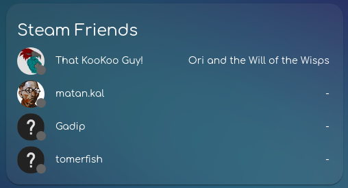

<p align="center">
  <a href="https://github.com/GewoonJaap/ha-nintendo-switch-card/" target="blank">
  </a>
  <h2 align="center">
    @kibibit/hass-kibibit-theme
  </h2>
</p>
<p align="center">
  <a href="https://www.npmjs.com/package/@gewoonjaap/ha-nintendo-switch-card"></a>
</p>
<p align="center">
  <a href="https://github.com/custom-components/hacs"></a>
  <a href="https://imgur.com/gallery/SQJNbWb"></a>
</p>
<p align="center">
  A Home Assistant card for Nintendo Switch integrations
</p>
<hr>

([Theme](https://github.com/kibibit/hass-kibibit-theme) used in screenshots)

## Screenshots

### away \ offline state


### online state


### while playing a game


## Installation

### Prerequisites
You need at least one Nintendo Switch integration to use with this card.

#### Setting up the Nintendo Switch integration
- Host the NX-API http server https://community.home-assistant.io/t/new-integration-nintendo-switch/564797/3
- Add the following to your configuration.yaml:
```yaml
  - platform: rest
    unique_id: nintendo_switch_activity
    name: "Nintendo Switch Activity"
    resource: http://NXAPI-ENDPOINT/api/znc/user
    headers:
      Authorization: na <SESSION TOKEN, STARTS WITH ey>
    scan_interval: 30
    json_attributes_path: $.user
    json_attributes:
      - id
      - nsaId
      - imageUri
      - name
      - supportId
      - isChildRestricted
      - etag
      - links
      - friendCode
      - permissions
      - presence
    value_template: "{{ value_json.presence.state }}"
```

### HACS (recommended)

1. Go to the Community Store.
2. Search for `Nintendo Switch Card` or add this repo to the custom HACS repositories (lovelace).
3. Press `Install`.

### Manual Installation

```yaml
resources:
  url: '<url-to-card.js>'
  type: module
```

## Usage

for a single user card, use `entity`:

```yaml
entity: sensor.nintendo_switch_activity
type: 'custom:ha-nintendo-switch-card'
```

you can change the username using the following:

```yaml
entity: sensor.nintendo_switch_activity
friendly_name: Myself
type: 'custom:ha-nintendo-switch-card'
```

for multiple users, use the `entities` attribute:


```yaml
entities:
  - sensor.nintendo_switch_activity
  - sensor.nintendo_switch_activity
  - sensor.nintendo_switch_activity
type: 'custom:ha-nintendo-switch-card'
```

you can also use a prefix selector to select all Nintendo Switch sensors:

```yaml
type: 'custom:ha-nintendo-switch-card'
entities: sensor.nintendo_switch_activity_
```

to show only **online users**, add the `online_only` attribute:

```yaml
type: 'custom:ha-nintendo-switch-card'
entities: sensor.nintendo_switch_activity_
online_only: true
```

you can also show the game header image as background with `game_background: true`:


```yaml
entities:
  - sensor.nintendo_switch_activity
  - sensor.nintendo_switch_activity
  - sensor.nintendo_switch_activity
friendly_name: hello
game_background: true
type: 'custom:ha-nintendo-switch-card'
```

## Stay in touch

- Author - [Jaap](https://github.com/GewoonJaap)
- Website - [https://mrproper.dev](https://mrproper.dev)

## Support

Hey dude! Help me out for a couple of :beers: or a :coffee: by clicking on the sponsering link!
